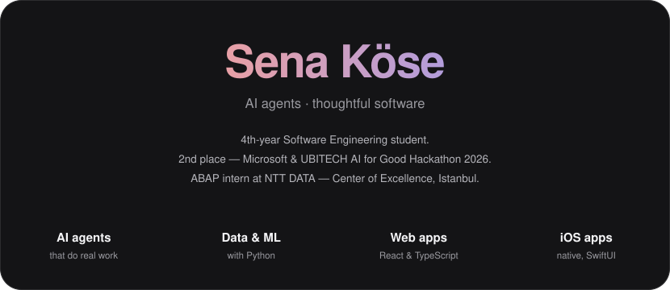
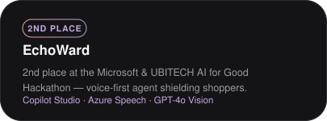
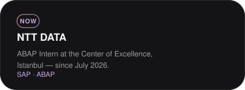
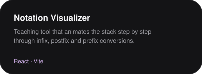

 

  

&nbsp;

   

<h3>Projects</h3>

 

&nbsp;

 

&nbsp;

 

&nbsp;

   

Swift · SwiftUI · React · TypeScript · Python · FastAPI · OpenCV · scikit-learn · Docker · Firebase · SAP ABAP

  

<a href="mailto:senakose.dev@gmail.com">senakose.dev@gmail.com</a> &nbsp;·&nbsp; <a href="https://www.linkedin.com/in/kosesena235">LinkedIn</a>

  

