

 

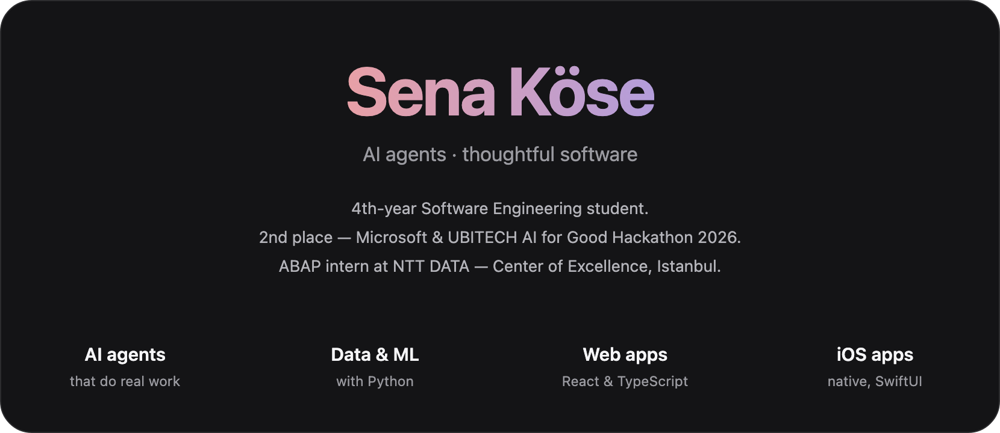

  

<a href="https://github.com/kosesena/echoward-ai-agent">
  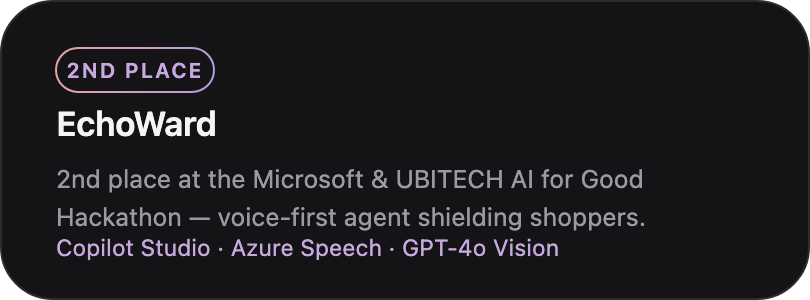
</a>
&nbsp;
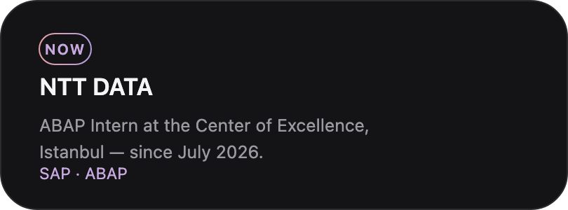

   

<h3>Open source</h3>

 

<a href="https://github.com/openai/openai-agents-python/commits?author=kosesena">
  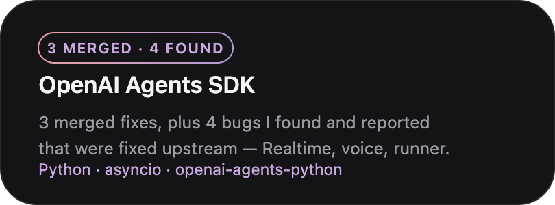
</a>
&nbsp;
<a href="https://github.com/search?q=author%3Akosesena+is%3Apr+is%3Amerged+-user%3Akosesena&type=pullrequests">
  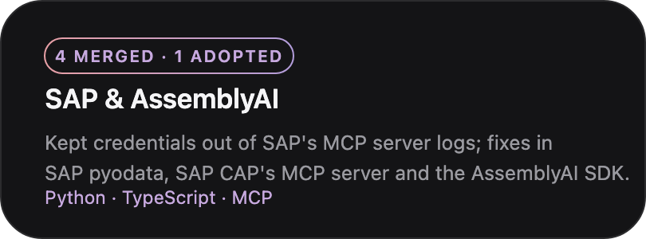
</a>

   

<h3>Projects</h3>

 

<a href="https://github.com/kosesena/GlovesOn">
  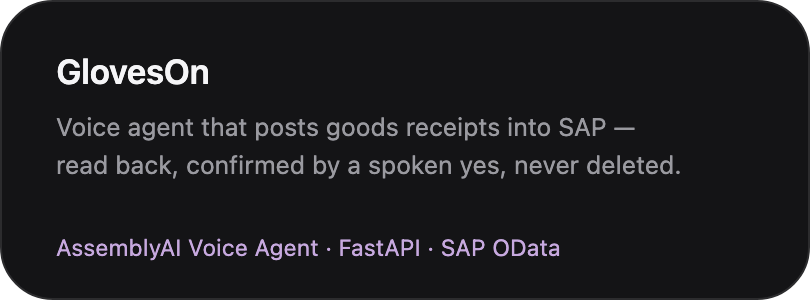
</a>
&nbsp;
<a href="https://github.com/kosesena/echoward-ai-agent">
  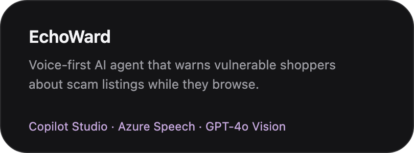
</a>

 

<a href="https://github.com/kosesena/omr-scanner">
  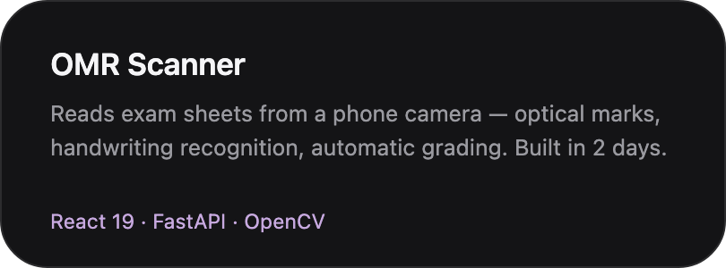
</a>
&nbsp;
<a href="https://github.com/kosesena/software-architecture-project">
  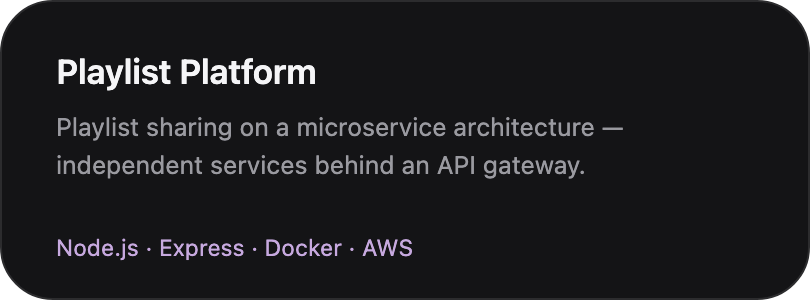
</a>

 

<a href="https://github.com/kosesena/infix-postfix-visualizer">
  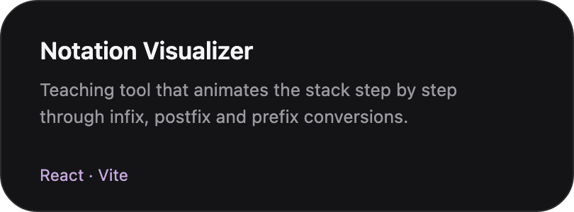
</a>
&nbsp;
<a href="https://github.com/kosesena/collatz-cipher">
  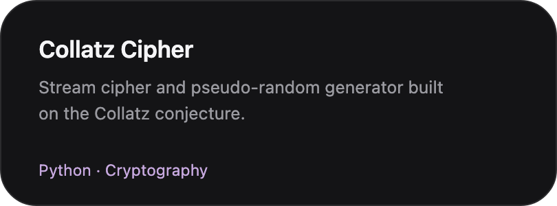
</a>

 

<a href="https://github.com/kosesena?tab=repositories&q=&type=source&language=jupyter+notebook">
  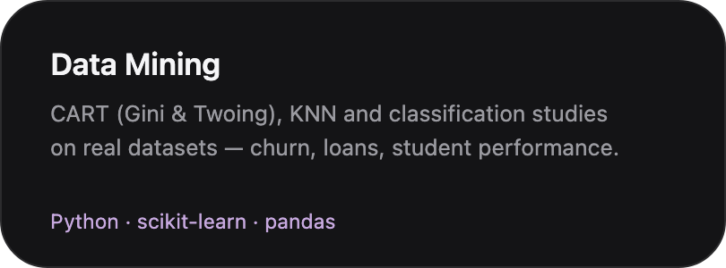
</a>

   

Swift · SwiftUI · React · TypeScript · Python · FastAPI · OpenCV · scikit-learn · Docker · Firebase · SAP ABAP

  

<a href="mailto:senakose.dev@gmail.com">senakose.dev@gmail.com</a> &nbsp;·&nbsp; <a href="https://www.linkedin.com/in/kosesena235">LinkedIn</a>

  

